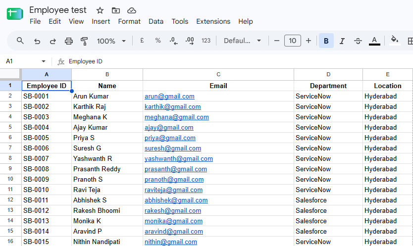
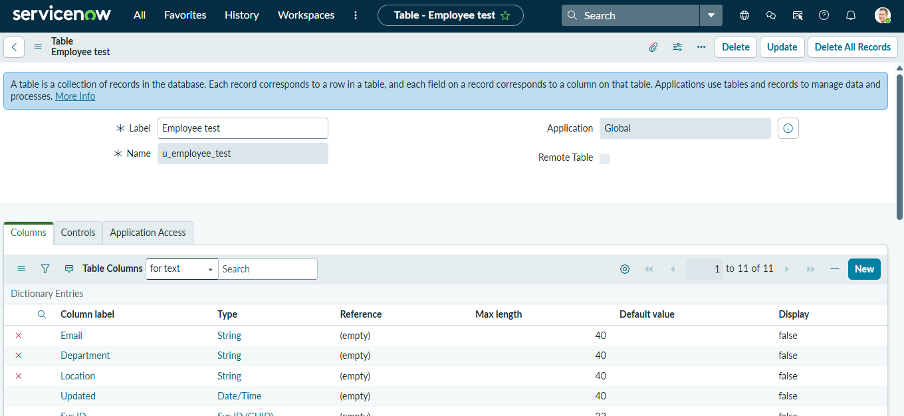
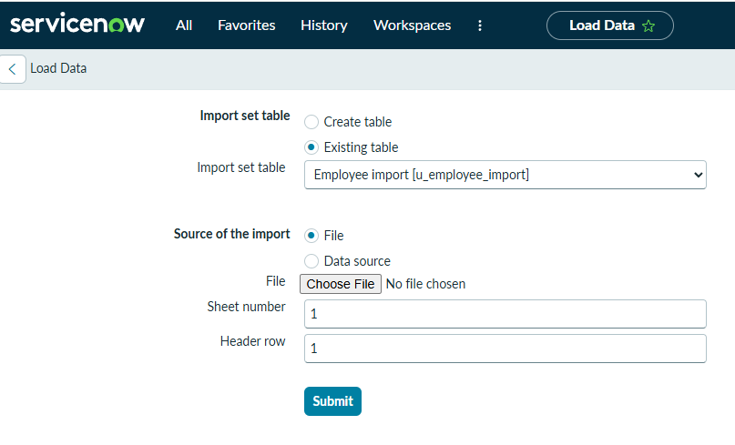
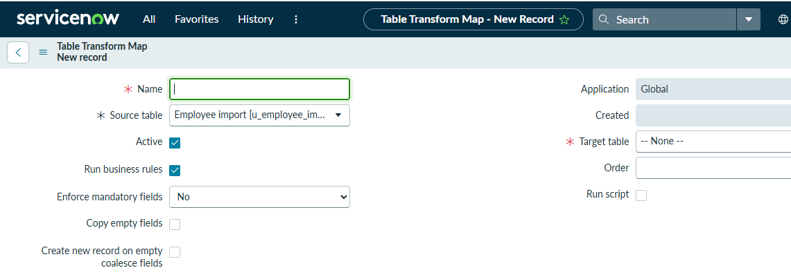
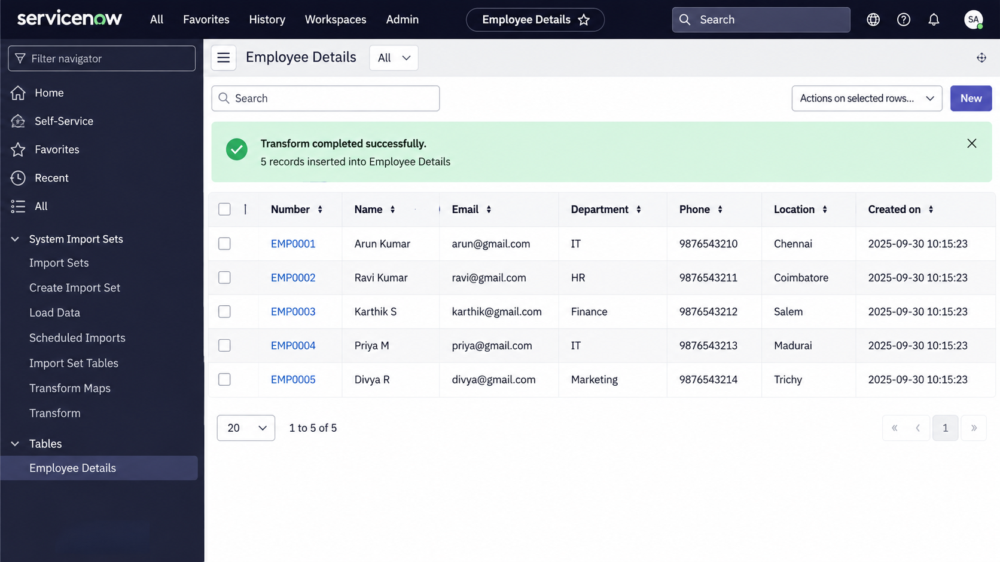

# Import Data using Transform Maps (Spreadsheet)

## 📌 Project Overview

This project demonstrates how to import data from a spreadsheet into **ServiceNow** using **Import Sets and Transform Maps**.

The spreadsheet data is imported into an Import Set Table, mapped to the required target table fields using a Transform Map, and then transformed into usable ServiceNow records.

## 🎯 Objective

The main objectives of this task are:

* Create a spreadsheet containing sample data.
* Import spreadsheet data into ServiceNow.
* Create an Import Set Table.
* Create a Transform Map.
* Configure source-to-target field mappings.
* Transform the imported data.
* Verify the records in the target table.

## 🛠️ Technologies Used

* **ServiceNow**
* **Import Sets**
* **Transform Maps**
* **Spreadsheet / Excel**
* **ServiceNow Tables**

## 📂 Project Structure

```text
Import-Data-using-Transform-Maps/
│
├── README.md
├── Sample_Data.xlsx
└── Screenshots/
    ├── 01-spreadsheet.png
    ├── 02-import-set-table.png
    ├── 03-import-data.png
    ├── 04-transform-map.png
    ├── 05-field-mapping.png
    └── 06-transformed-records.png
```

## 📊 Sample Spreadsheet Data

| Name       | Email                                         | Department | Phone      | Location   |
| ---------- | --------------------------------------------- | ---------- | ---------- | ---------- |
| Arun Kumar | [arun@gmail.com](mailto:arun@gmail.com)       | IT         | 9876543210 | Chennai    |
| Ravi Kumar | [ravi@gmail.com](mailto:ravi@gmail.com)       | HR         | 9876543211 | Coimbatore |
| Karthik S  | [karthik@gmail.com](mailto:karthik@gmail.com) | Finance    | 9876543212 | Salem      |
| Priya M    | [priya@gmail.com](mailto:priya@gmail.com)     | IT         | 9876543213 | Madurai    |
| Divya R    | [divya@gmail.com](mailto:divya@gmail.com)     | Marketing  | 9876543214 | Trichy     |

## 🔹 Step 1: Create Spreadsheet

A spreadsheet containing the required employee data was created.

The spreadsheet contains fields such as:

* Name
* Email
* Department
* Phone
* Location

**Screenshot:**



## 🔹 Step 2: Create Import Set Table

An Import Set Table was created in ServiceNow to temporarily store the data imported from the spreadsheet.

**Screenshot:**



## 🔹 Step 3: Import Spreadsheet Data

The prepared spreadsheet was uploaded into ServiceNow using the Import Set functionality.

The imported records were stored in the Import Set Table.

**Screenshot:**


## 🔹 Step 4: Create Transform Map

A Transform Map was created to define how the imported source data should be transferred to the target table.

The source table and target table were selected during the Transform Map configuration.

**Screenshot:**

## 🔹 Step 5: Configure Field Mapping

The fields from the source spreadsheet were mapped to the corresponding fields in the target table.

| Source Field | Target Field |
| ------------ | ------------ |
| Name         | Name         |
| Email        | Email        |
| Department   | Department   |
| Phone        | Phone        |
| Location     | Location     |


## 🔹 Step 6: Run Transform

After configuring the field mappings, the Transform process was executed.

The imported data was transformed and inserted into the target table.

## 🔹 Step 7: Verify Records

The transformed records were verified in the target table to ensure that the spreadsheet data was imported correctly.

**Screenshot:**



## ✅ Result

The spreadsheet data was successfully imported into ServiceNow using **Import Sets and Transform Maps**.

The source fields were correctly mapped to the target table fields, and the transformed records were successfully created in the target table.

## 📚 Key Learnings

Through this task, the following ServiceNow concepts were learned:

* Spreadsheet data import
* Import Sets
* Import Set Tables
* Transform Maps
* Source and Target Tables
* Field Mapping
* Data Transformation
* Record Verification

## 🏁 Conclusion

The **Import Data using Transform Maps** task demonstrates how external spreadsheet data can be efficiently imported and transformed into ServiceNow records.

This process is useful for migrating and integrating data from external sources into ServiceNow.

---

### 👨‍💻 Project

**Import Data using Transform Maps (Spreadsheet)**

**Platform:** ServiceNow

**Repository:** Import-Data-using-Transform-Maps
### Team 
Team Leader : Thanish V

Team Members:
- Parthipan G
- Bharathraj P 
- Guru Krishna P
              
